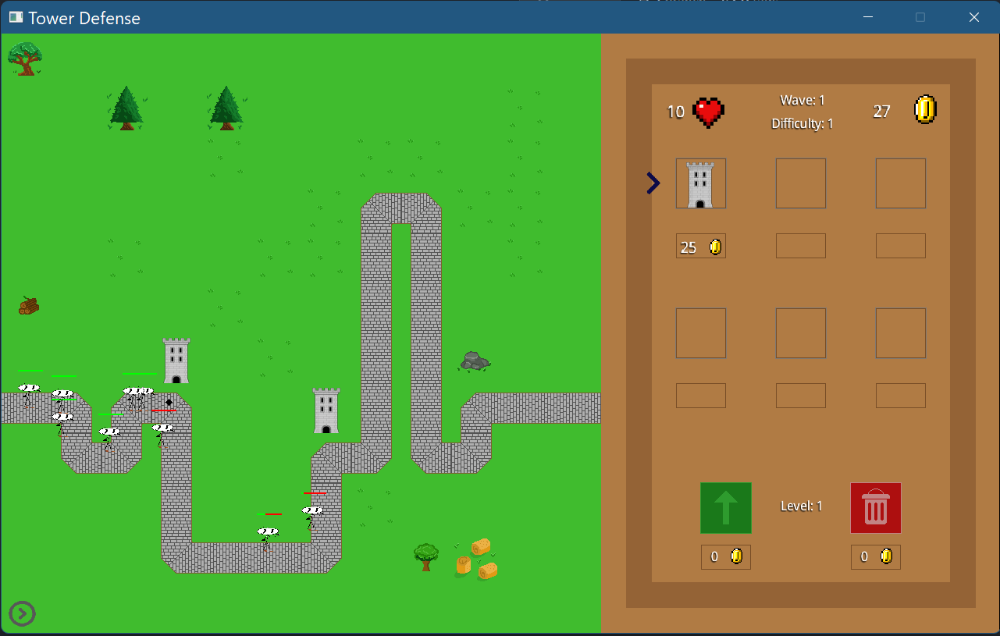

# Projet_Tower_Defense

Jeu 2D type Tower Defense développé avec libGDX

- deux modes: arcade VS campagne
- différents niveaux de difficulté
- génération aléatoire de maps (chemin, décor)
- différents types de tours
- système d'argent (boutique)